**`Software Engineer & Researcher `**

Building software with discipline, technical depth, and a constant commitment to learning.
Interested in software architecture, clean code, system design, engineering principles, and problem solving — seeking to understand systems deeply, question decisions, and turn complexity into simple, reliable, and maintainable solutions..

    

---

### 🤖 Languages and Technologies

         

          

 
 

### 📊 Statistics

  
  

 

 
 
